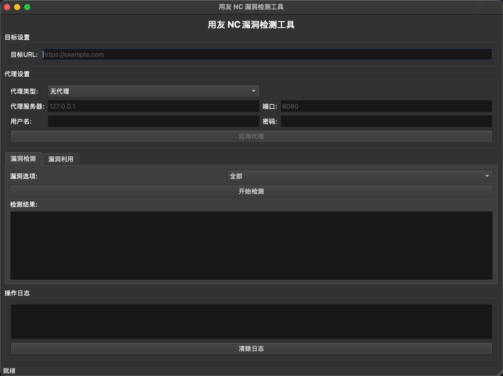

# Tips：程序大部分由 AI 生成，仅用于学习和研究，不建议在生产环境中使用

漏洞利用模块还在施工中......



# 漏洞扫描与利用工具

这是一个使用PyQt6构建的图形化漏洞扫描与利用工具，支持代理设置、漏洞检测和漏洞利用功能，并提供实时日志显示。

## 功能特点
- **代理设置**：支持HTTP和SOCKS5代理，可配置代理服务器、端口、用户名和密码
- **漏洞检测**：可对目标URL进行多种漏洞类型的检测
- **漏洞利用**：支持选择不同类型的漏洞进行利用，并可配置利用参数
- **实时日志**：详细记录所有操作过程和执行结果
- **多线程处理**：后台线程处理扫描任务，避免UI卡顿

## 环境要求
- Python 3.8 或更高版本
- PyQt6 6.4.0 或更高版本
- requests 2.25.0 或更高版本

## 安装说明
1. 首先确保已安装Python 3.8+。
2. 克隆或下载此项目到本地。
3. 打开终端，导航到项目目录：
   ```
   cd yongyou-scan/
   ```
4. 安装依赖包：
   ```
   pip install -r requirements.txt
   ```

## 运行应用
在项目目录下，执行以下命令：
```
python main.py
```

## 注意事项
- 此工具仅用于安全研究和授权测试
- 请勿用于未授权的系统扫描和漏洞利用
- 使用此工具造成的任何后果由使用者自行承担